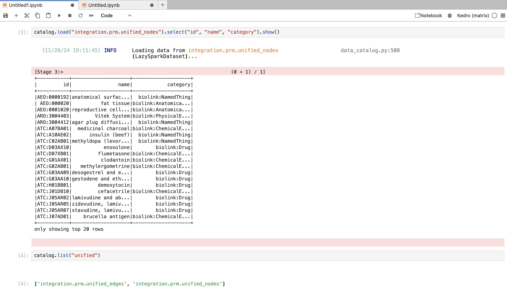

# `v0.2.5`: First stable integrated KG release, improving ROBOKOP integration, first version of Matrix CLI, and enhancing pipeline control

This release of the Matrix Platform focuses on improving developer experience and enhancing data integration and pipeline control.  We introduce a new command-line interface (CLI), integrate the ROBOKOP
knowledge graph with RTX-KG2 (v2.7.3)[^1], and provide more granular control over pipeline execution.

<!-- more -->

## How to get access to the data published in this release

!!! info
    All the below commands assume you are checking out the `main` branch of the Matrix repository. To make sure you get a specific release, you can either check out the specific release tag or set the `RELEASE_NAME` environment variable to the release you want to use. When checking out the tag, you also get the codebase from that release. When you set the `RELEASE_NAME` environment variable, you get the data from the release, but the codebase of your current branch.

### Using the CLI or via Jupyter Notebooks

The quickest way to explore the data is using IPython:

```bash
kedro ipython --env cloud
```

This will start an IPython session with the following variables automatically loaded:
- `context`: The Kedro project context
- `catalog`: The data catalog containing all datasets
- `parameters`: Project parameters

You can then load any dataset using:

```python
df = catalog.load("dataset_name")
```

For more details on how to use this, please refer to the [Kedro documentation](https://kedro.org/community/tutorials/kedro-ipython).

#### Using Jupyter Notebook

To explore the data in a Jupyter notebook:

```bash 
kedro jupyter lab --env cloud
```

This will start a Jupyter server with the Kedro context loaded. The same variables (`context`, `catalog`, `parameters`) will be available in your notebook.



To reload the Kedro context at any time in your notebook (e.g. after changing configurations), use:

```python
%reload_kedro
```

!!! tip
    We recommend checking the official [Kedro documentation](https://docs.kedro.org/en/stable/notebooks_and_ipython/kedro_and_notebooks.html#loading-the-project-with-kedro-jupyter-notebook) on this feature for more details.

#### Specifying a Different Release

By default, the data access will use the release specified in `conf/cloud/globals.yml`, to use a different release:

Update the `RELEASE_NAME` in `.env`:

```
RELEASE_NAME=v0.2.5-rtx-only #to use a release that only includes RTX data
```

!!! tip
    If you want to get a list of all current releases, while we are working on a more centralized solution, you can run either `git tag` to see a list (data available starting from `v0.2.5`) or by running
    ```
    gsutil ls gs://mtrx-us-central1-hub-dev-storage/kedro/data/releases/
    ```

    which lists the folder containing all release runs. Note that not every folder will contain all data today, but we are working towards making sure they will always contain a complete release.

Reload your kedro context for the changes to take effect

### Via BigQuery

Simply navigate to the [BigQuery console](https://console.cloud.google.com/bigquery?inv=1&invt=Abitqg&project=mtrx-hub-dev-3of&ws=!1m4!1m3!3m2!1smtrx-hub-dev-3of!2srelease_v0_2_5_rc1)
and select the release you want to explore.

### When developing a new kedro node 

We would recommend building a clean python function in a notebook which consumes the
datasets of interest (e.g. `integration.prm.unified_nodes`). When you are happy with the
function, you can copy it into the right place in the pipeline (various `nodes.py` files in `pipelines/matrix/src/matrix/pipelines/`) and wire it up with the rest of the pipeline using the syntax shown in various `pipeline.py` files.

## Other Enhancements 🚀

### ROBOKOP Knowledge Graph Integration 🌐

The platform now supports instantiating an integrated version of RTX-KG2 and ROBOKOP as
the knowledge graph on which models can be run. This integration will undergo quality
validation ahead of planned data experiments to test whether a combined knowledge graph
improves performance compared to using individual knowledge graphs. While the integration
provides optionality for richer context and potentially more comprehensive drug
repurposing analysis, it is not enforced as the default. 

In December, we plan to integrate SPOKE as a third knowledge graph for testing the
hypothesis that more integrated information leads to better predictions.

To read only a specific knowledge graph from our combined data, you can filter the nodes such as in the below example:

```python
from pyspark.sql import functions as f
nodes = catalog.load("integration.prm.unified_nodes")
nodes.show()
# note this loads data from the cloud which may take a while depending on your internet connection
nodes.filter(f.array_contains("upstream_data_source", "RTXKG2")).show()
```

### GPU Support ⚡️

The platform now leverages GPUs on the cluster, accelerating computationally intensive tasks.  Additionally, the integration of Neo4j Enterprise license keys unlocks advanced features and performance
optimizations for graph database operations. These infrastructure upgrades significantly improve the platform's efficiency and scalability.  See issue [#622](https://github.com/everycure-org/matrix/issues/622) for more details.

### Matrix CLI ⌨️

A new command-line interface, `matrix-cli`, streamlines various project tasks. The CLI offers a centralized interface for managing GitHub users and teams, generating release notes with AI assistance, and
summarizing code changes. This simplifies common workflows and improves developer productivity.


!!! tip
    This CLI is very early in development, and we would love to hear from you if you have any feature requests or feedback.
    Try it by switching to `apps/matrix-cli`, and running `uv run matrix`

### Enhanced `kedro submit` Command  ⚙️

The `kedro submit` command has been significantly enhanced, providing developers with more fine-grained control over pipeline execution. It now supports running pipelines from specific nodes and submitting
to different folders (test/release), enabling greater flexibility in development, testing, and deployment workflows. See issues [#605](https://github.com/everycure-org/matrix/issues/605) and [#611](https://github.com/everycure-org/matrix/issues/611) for more details.

### Kedro Catalog Cleanup 🧹

- Addressing technical debt, this release includes fixes for missing and unused entries in the Kedro catalog (issue [#600](https://github.com/everycure-org/matrix/issues/600)).
- More robust handling of node category selection during integration (issue [#654](https://github.com/everycure-org/matrix/issues/654)).
- We also moved a variety of older datasets and files from the cloud bucket to an `archive` folder, simplifying the folder structure in our cloud bucket. However, we expect most people will no longer need to think about direct file access as we mature our data catalog & bigquery release strategy.

### Enhanced Developer Experience 🧰

Several improvements streamline the developer experience:

- **Argo Workflow Submission Enhancements:** Improved Argo workflow submission (issue [#565](https://github.com/everycure-org/matrix/issues/565)) simplifies pipeline orchestration and execution.
- **BigQuery Integration Enhancements:**  Improvements to BigQuery integration through GCS filesystem datasets and external table registration (issue [#563](https://github.com/everycure-org/matrix/issues/563)) streamline data loading and access.
- **Developer Namespaces:**  Introduction of developer namespaces (issue [#605](https://github.com/everycure-org/matrix/issues/605)) improves resource isolation and facilitates parallel development efforts. If you need a workspace to test something, please send us a PR adding yourself to `infra/argo/applications/dev-namespaces/values.yaml`.
- **BTE-TRAPI & Redis Integration:** (issue [#605](https://github.com/everycure-org/matrix/issues/605)).
- **ArgoNode Wrapper:**  The introduction of the ArgoNode wrapper (issue [#626](https://github.com/everycure-org/matrix/issues/626)) allows for defining GPU, CPU and RAM requirements for nodes.
- **Partitioned Dataset Embeddings:**  Implementation of efficient embedding computation using PartitionedDataset, batch processing, and LangChain integration (issue [#642](https://github.com/everycure-org/matrix/issues/642)) improves performance for large-scale embedding generation.

### Ongoing Modelling Workstreams

We have progressed the following workstreams: 

 - Successfully completed a first run of our supervised mechanism of action algorithm. This should provide greater transparency into our model predictions ([#510](https://github.com/everycure-org/matrix/pull/510). We are also building an MVP for visualizing these MoA paths. 
 -  We have developed a first version of adding timestamps to the edges, and now have ~27% timestamped. This should enable us to execute more robust time-split-validation experiments in the future. ([#588](https://github.com/everycure-org/matrix/issues/588))
 - Work to compare performance of existing models with TxGNN has made significant progress and our first experimental runs are now complete. Ongoing work will compare this method with our baseline KGML-xDTD approach. ([#586](https://github.com/everycure-org/matrix/issues/586))
- We now have the ability to perform multiple folds of cross validation in the modeling and evaluation suite. This should enable us to better estimate stability and confidence in our model predictions ([#587](https://github.com/everycure-org/matrix/issues/587))
- We have implemented the ability to run a full comparison of treat scores using various embedding models, such as Node2Vec, PubmedBERT, and OpenAI ([#301](https://github.com/everycure-org/matrix/issues/301).

## Next Steps 🔮

We are currently working on a new releases page where we will collect all releases and their key parameters. We will also explore data catalog tooling to make this more accessible. For now, please check the [overview](../../release_history.md) page for a first version.


[^1]: Note RTX KG2 upgrade to 2.10 has already been tested and will be part of our next data release. We want to create this release to enable people to run tests also with the older version and compare results to existing model results on the older version.