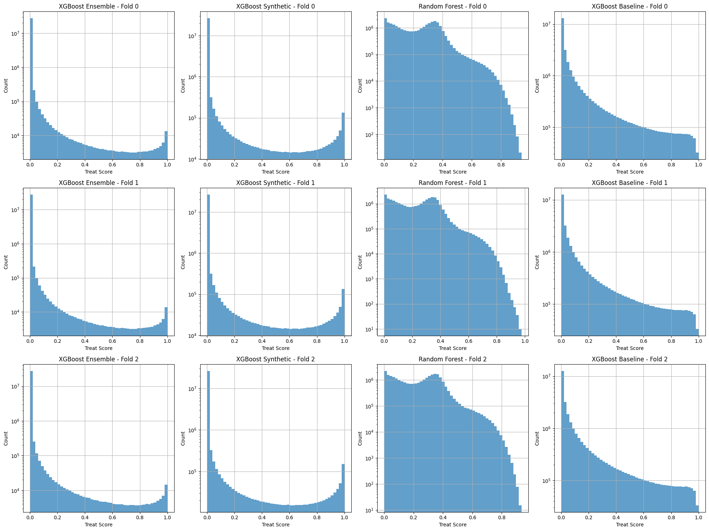
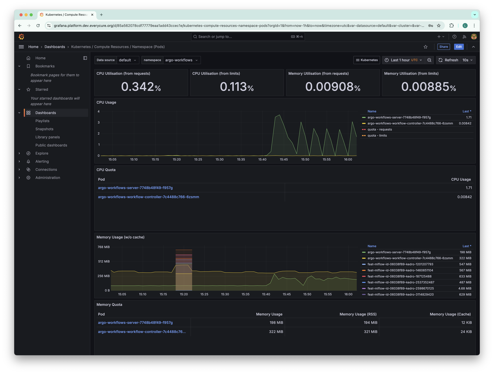
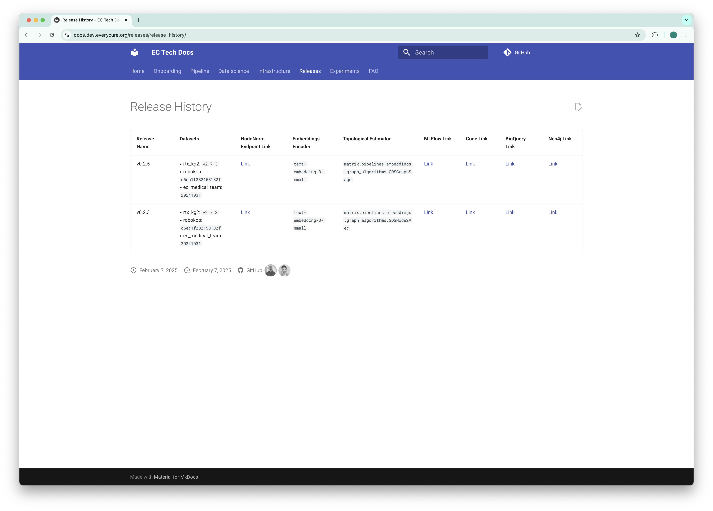
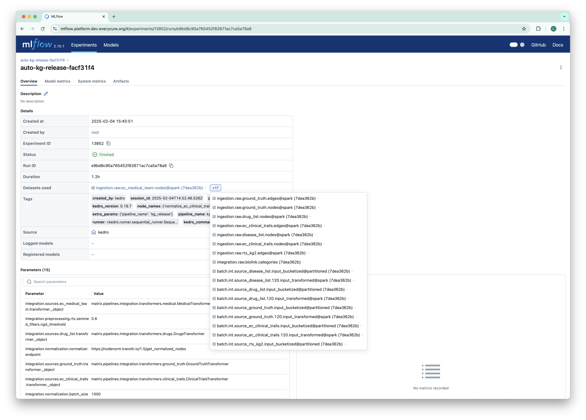

# Matrix Platform `v0.3.0`: Unified integration, sampling and model stability

The release introduces a new unified integration layer, a sampling mechanism and a suite of
stability metrics.

<!-- more -->

!!! tip
    To check out this release, run `git checkout v0.3.0`.

## Key Enhancements

### Unified integration layer and Spoke integration

So far, the process of integrating datasets has been ad-hoc, in the sense that we need to add
additional pipeline steps for each source. Over time, we've learned that this process is fairly
structured, i.e.,

1. Transform the nodes into our unified format
2. Transform the edges into our unified format
3. Normalize nodes identifiers (CURIEs) to ensure the same identifier universe is used

We've implemented this streamlined process across all of our sources, hugely simplifying the
integration of new sources. Moreover, we've setup the integration for Spoke, a new knowledge graph
that we aim to use in the future.

### Sample pipeline

The matrix pipeline integrates a wide variety of data sources, and trains complex machine models on
top. Over time, the pipeline grew tremendously, rendering end-to-end runs on real data intractable
for development purposes. To speed this up, we had implemented runs on synthetic data. This
technique has proven quite relevant during the initial stage of introducing new features, but it
failed to surface issues related to the data quality of our sources.

To bridge this gap, we've introduced the ability to run the pipeline on a sample of data, giving
more confidence that the pipeline will run end-to-end in a timely manner. The sample pipeline
samples the integrated knowledge graph, therefore this feature is available to the embeddings
pipeline and on.

### K-fold cross-validation and stability metrics

So far, our pipeline is producing a single model on the entire data. Though, it was still possible
that we got lucky with our choice of seed, thereby getting a good model by coincidence. Good modes
are _stable_, meaning that changes in subsets of data and seeds yield models with similar
performance. We've updated our pipeline to train multiple models, on different subsets of data,
allowing us to assess model stability.

We've also extended our pipeline evaluation suite to produce model stability metrics. The screenshot
below shows a distribution of treat scores for the matrix across the folds.

### Deploy Grafana and Prometheus for improved cluster observability

Workloads running on Kubernetes might fail due to them hitting resource limits. GCP provides some
observability insights, but remains quite limited. We've therefore installed Grafana and Prometheus
on the cluster.

### Improved data tracking

#### Releases page

We can split our Matrix pipeline in two major stages, i.e., the process that produces a data
release, i.e., an integrated knowledge graph, and the stage that trains the model. For each data
release, we're now keeping track of data versions [on our micro site](../../release_history.md).

We will continue to expand this page to include more information about the data releases.
We are also looking for a more standardized approach to publish (internal) datasets in
the form of a dataset catalog, especially as we start building multiple features based on
the KG which will become distinct datasets that can be consumed

#### MLFlow

MLflow now logs the datasets used within the pipeline. This significantly improves the traceability
of experiments by recording the exact data versions used for each run. This feature enhances
reproducibility and provides valuable context for analyzing experiment results. (PR #1048)

## Bug Fixes

Several critical bugs were addressed in this release, improving the stability and reliability of the
platform:

- **Clinical Trial Preprocessing:** Fixed an issue in the clinical trial preprocessing nodes,
  ensuring the correct handling and preparation of clinical trial data for downstream analysis. (PR
  #1039)
- **Data Normalization Status:** Corrected the normalizer to accurately reflect the
  `normalization_success` status, providing more reliable feedback on the data normalization
  process. (PR #1060)
- **MLflow Metric Tracking:** Fixed an issue affecting MLflow metric tracking, ensuring accurate
  recording and reporting of experiment metrics. (PR #1075)

## Technical Enhancements

This release includes several technical enhancements that improve efficiency, robustness, and
maintainability:

- Added **GitHubReleaseCSVDataset** to streamline ingestion of sources from GitHub releases into the
  pipeline. (PR #1050)

- Added automation to **orchestrate periodic data releases**, ensuring a monthly data release (PR
  #877)

- Simplify pipeline to produce _single model_ per run, streamlining comparability across runs (PR
  #924)

- Update pipeline to use
  **[Pandera](https://pandera.readthedocs.io/en/stable/dataframe_schemas.html)** for runtime data
  quality checks, removing dependency on private package (PR #938)
