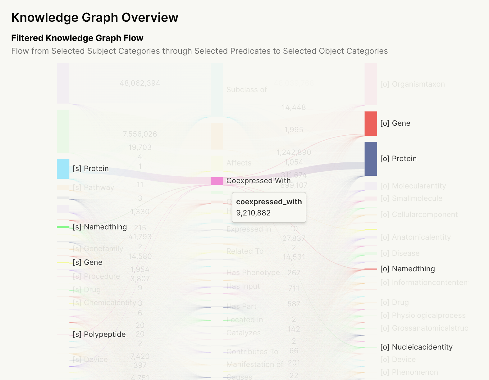
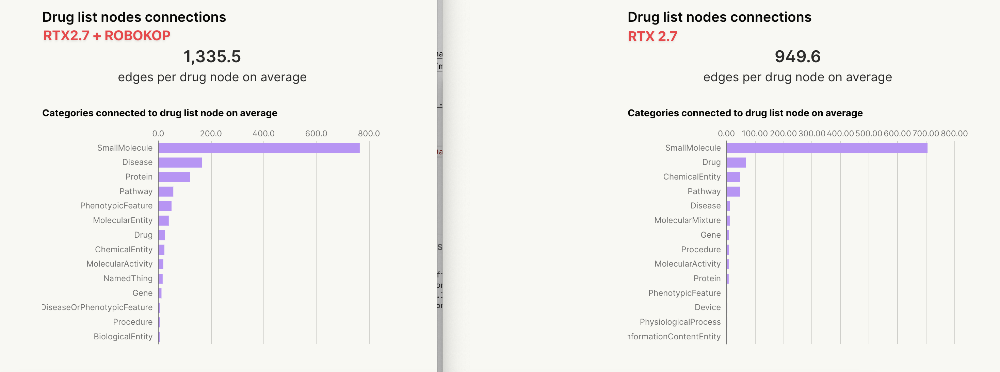
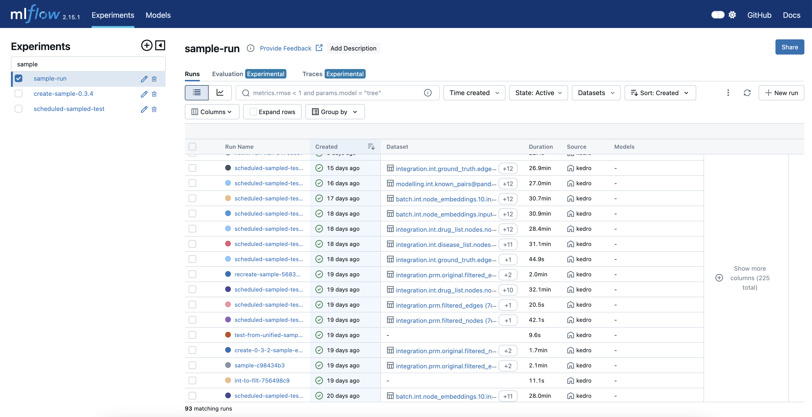

# `v0.4.0`: Evidence.dev dashboard, improved experiment tracking

This release of Matrix includes a new [data
dashboard](https://data.dev.everycure.org/versions/latest/evidence) based on
evidence.dev, a new pipeline submission process which groups experiment runs under their
respective experiments and a scheduled daily run of the entire pipeline using a KG sample to get fast feedback on the stability of our pipeline with real data. 

<!-- more -->

## KG Dashboard

### Graph connectivity overview

We added a new dashboard based on evidence.dev to enable us to share detailed insights
into the makeup of our knowledge graphs. Each release of the KG is paired with a
dashboard that shows metrics and visualisations about the structure of the KG.

### Quality Control Dashboard for our data releases

We started collecting quality control metrics for our data releases. [Data build `v0.4.3` for example](https://data.dev.everycure.org/versions/v0.4.3/evidence/summary/) shows that the number of diseases connected to drugs in the KG drastically increased when we added ROBOKOP as a data source.

## Pipeline Submission

We updated the pipeline submission process to group experiment runs under their
respective experiments. This should make it easier to track the evolution of the pipeline
over time. All runs of one experiment are bundled together in a single experiment run
in the MLFlow UI. This ensures iterative debugging does not impede the visibility of what
experiments have been run.

## Scheduled Pipeline Runs with sample data

In an effort to increase our feedback velocity, we wanted to run the pipeline more
regularly to know when integrated pieces may lead to issues. As with any complex system,
a tradeoff needs to be found between the cost of running the pipeline and the benefits of
the feedback. We decided to run the pipeline on a _sample_ of the KG to get fast feedback
on the stability of our pipeline with real data while avoiding the cost of running the
pipeline on the entirety of the KG. This should lead to ~ 90% lower costs per run while
still providing a good indicator of the pipeline's stability.

This includes two new workflows:

1. the [creation of the sample data](https://github.com/everycure-org/matrix/blob/main/.github/workflows/create-sample-release.yml) whenever a new release is created.
2. a [scheduled workflow](https://github.com/everycure-org/matrix/blob/main/.github/workflows/scheduled-sampling-pipeline.yml) that runs the pipeline on the sample data every day at 5am GMT.

For more details, check the [documentation on the sample environment](../../../getting_started/deep_dive/sample_environment.md).

## Full Changelog

For the full changelog, see the [GitHub release page](https://github.com/everycure-org/matrix/releases/tag/v0.4.0)