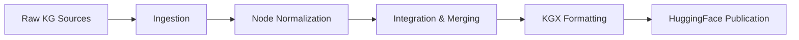

# Public Data Releases

Every Cure publishes datasets from the MATRIX pipeline on Hugging Face Hub,
making them accessible for researchers, data scientists, and developers who want to experiment
with biomedical knowledge graphs, drug lists, disease lists, and drug repurposing applications.

## Available Datasets

| Dataset | Description | Link | Docs |
|---------|-------------|------|------|
| **kg-nodes** | Knowledge graph nodes (entities) | [everycure/kg-nodes](https://huggingface.co/datasets/everycure/kg-nodes) | |
| **kg-edges** | Knowledge graph edges (relationships) | [everycure/kg-edges](https://huggingface.co/datasets/everycure/kg-edges) | |
| **drug-list** | EC Drug List — curated list of ~1,800 drugs with metadata | [everycure/drug-list](https://huggingface.co/datasets/everycure/drug-list) | [EC Drug List](../pipeline/data/ec_drug_list.md) |
| **disease-list** | EC Disease List — curated list of ~22,000 diseases | [everycure/disease-list](https://huggingface.co/datasets/everycure/disease-list) | [Disease List](../pipeline/data/drug_disease_lists.md) |

All datasets are published as Parquet files, making them easy to load with common data science tools
like pandas, polars, PySpark, or the Hugging Face `datasets` library.

See the dataset pages on Hugging Face for detailed schema documentation and data previews.

## Data Sources

The published knowledge graph integrates data from two publicly available knowledge sources:

| Source | Description |
|--------|-------------|
| **[RTX-KG2](https://github.com/RTXteam/RTX-KG2)** | Large biomedical KG from the Translator RTX team integrating UMLS, ChEMBL, DrugBank, and more |
| **[ROBOKOP](https://robokop.renci.org/)** | Question-answering system and KG from the NCATS Translator program |

For detailed information about each knowledge source, see the [Attribution](attribution.md)
and [First-level Knowledge Sources](knowledge_sources.md) pages.

## Processing Pipeline Overview

The data published to Hugging Face undergoes several processing steps:



1. **Ingestion**: Raw data from each knowledge source is loaded and validated
2. **Node Normalization**: Entities are mapped to canonical identifiers using the NCATS Node Normalizer
3. **Integration & Merging**: Data from all sources is unified, with equivalent entities merged and relationships deduplicated
4. **KGX Formatting**: Data is transformed to the [KGX](https://github.com/biolink/kgx) exchange format
5. **Publication**: Final datasets are uploaded to Hugging Face Hub as Parquet files

## Quick Start

### Loading with Hugging Face datasets

```python
from datasets import load_dataset

# Load nodes
nodes = load_dataset("everycure/kg-nodes", split="train")
nodes_df = nodes.to_pandas()

# Load edges
edges = load_dataset("everycure/kg-edges", split="train")
edges_df = edges.to_pandas()
```

### Loading with pandas

```python
import pandas as pd

# Load directly from Hugging Face
nodes_df = pd.read_parquet(
    "hf://datasets/everycure/kg-nodes/data/nodes/train-00000-of-00001.parquet"
)
edges_df = pd.read_parquet(
    "hf://datasets/everycure/kg-edges/data/edges/train-00000-of-00001.parquet"
)
```

### Loading with PySpark

```python
from pyspark.sql import SparkSession

spark = SparkSession.builder.getOrCreate()

nodes_df = spark.read.parquet(
    "hf://datasets/everycure/kg-nodes/data/nodes/"
)
edges_df = spark.read.parquet(
    "hf://datasets/everycure/kg-edges/data/edges/"
)
```

## Licensing

The public datasets are released under the **Creative Commons Attribution 4.0 International (CC-BY 4.0)** license.

!!! warning "Pass-through License Clause"

    The CC-BY license applies to the creative work Every Cure has performed in integrating,
    normalizing, and processing the data. However, **the original license terms of each
    upstream data source continue to apply** to any content derived from those sources.

    When using this data, you must:

    1. Attribute Every Cure for the integrated dataset
    2. Comply with the license terms of any upstream sources whose data you use

    Consult the [Attribution](attribution.md) page for details on upstream source licenses.

## Release Schedule

All datasets are updated periodically as new versions are released.

Check the dataset pages for version history and release dates.

## Developer Documentation

For technical details on how the data publication pipeline works, including how to add new
datasets or modify the publication process, see the
[Data Publication Pipeline README](https://github.com/everycure-org/matrix/blob/main/pipelines/matrix/src/matrix/pipelines/data_publication/README.md).

## Feedback and Issues

If you encounter issues with the published datasets or have suggestions for improvements,
please open an issue on our [GitHub repository](https://github.com/everycure-org/matrix/issues).
