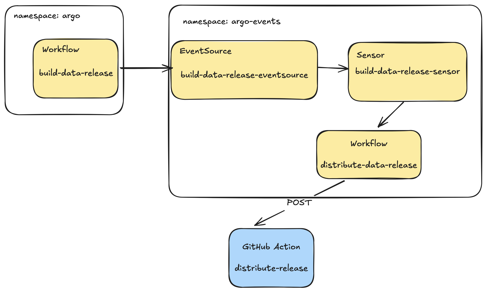

# Dummy Workflow Argo

https://docs.dev.everycure.org/infrastructure/argo_workflows_locally/  
https://kind.sigs.k8s.io/docs/user/quick-start  
https://argoproj.github.io/argo-events/installation/  



```
kind get clusters  
kind create cluster --name kind-4  
kubectl config current-context  

kubectl create namespace argo  
kubectl apply -n argo -f https://raw.githubusercontent.com/argoproj/argo-workflows/refs/heads/main/manifests/quick-start-minimal.yaml  

kubectl create namespace argo-events  
kubectl apply -f https://raw.githubusercontent.com/argoproj/argo-events/stable/manifests/install.yaml  
kubectl apply -f https://raw.githubusercontent.com/argoproj/argo-events/stable/manifests/install-validating-webhook.yaml  
kubectl apply -n argo-events -f https://raw.githubusercontent.com/argoproj/argo-events/stable/examples/eventbus/native.yaml  

kubectl -n argo port-forward service/argo-server 2746:2746  

kubectl create -f ArgoEventsClusterServiceAccount.yaml  
```

You cannot use a Service Account (even the one with a cluster role attached to it) created in one namespace, from another namespace.  

Example:  
I created a service account with a cluster role attached to it in the namespace argo-events. I want to use it in a workflow that lives in the namespace argo. It throws this error:  

```

error in entry template execution: pods "build-data-release-hmm67" is forbidden: error looking up service account argo/argo-events-cluster-service-account: serviceaccount "argo-events-cluster-service-account" not found  
```

This means we need to create two service accounts in each namespace.  
```

kubectl create -f ArgoClusterServiceAccount.yaml  
kubectl create -f BuildDataReleaseEventSource.yaml  
kubectl create -f BuildDataReleaseSensor.yaml  
```

Evensources and sensors will spin up their own pods. They must be created in the same namespace as the eventbus (argo-events). Make sure the pods are running and healthy:  
```

kubectl get pods -n argo-events  
```

If not, inspect the logs:  

```
kubectl logs build-data-release-eventsource-eventsource-5s9dd-5dd77679dc6wdb -n argo-events  
```

Generate the GitHub token as a secret. Must be base64 encoded:  

```
echo -n "your_token" | base64  
```

Add it to the below file and create it:  

```
kubectl create -f GithubTokenSecret.yaml  
```

Trigger the initial workflow and watch the chain of events:  
```

kubectl create -f BuildNewReleaseWorkflow.yaml  
```

