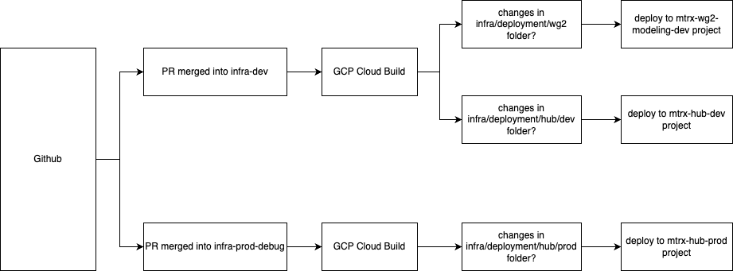

# GCP CloudBuild

## Rationale

This document outlines the working of GCP CloudBuild in our project. We introduced CB because we saw a need to replace our Github Actions for Open Sourcing our Infra code.

---

## Special Note

We would need to run `terragrunt run-all apply` the first time, as this would require boostraping the SA etc as we are using gitcrypt and it would be needed to be stored in Google Secret Manager.

## GCP Projects invovled:

At the time of writting, these GCP projects are invovled:

1. Matrix Hub Dev (mtrx-hub-dev project)
2. Matrix Hub Prod (mtrx-hub-prod project)
3. Workbench 2 (mtrx-wg2-modeling-dev)

---

## Deployment Flow

GCP Cloud Build runs when the following conditions are met. This is detailed in the Workflow Diagram.

---

## Important Variables

The variables required to terraform the module `cloudbuild` is:

| Name                         | Description                                                                                                                                                                                                                      | Type   | Example                                 |
|------------------------------|----------------------------------------------------------------------------------------------------------------------------------------------------------------------------------------------------------------------------------|--------|----------------------------------------|
| `project_id`                 | The GCP project ID.                                                                                                                                                                                                              | string | `"my-gcp-project"`                      |
| `github_app_installation_id`| The GitHub App installation ID. More info: [Google Cloud Docs](https://cloud.google.com/build/docs/automating-builds/github/connect-repo-github?generation=2nd-gen)                                                               | string | `"12345678"`                            |
| `github_repo_owner`          | The owner of the GitHub repository.                                                                                                                                                                                              | string | `"my-org"`                              |
| `github_repo_name`           | The name of the GitHub repository.                                                                                                                                                                                               | string | `"my-repo"`                             |
| `github_repo_token`          | The Personal Access Token.                                                                                                                                                                                                       | string | `"ghp_xxxxxxxxxxxxxxxxxxxxxx"`          |
| `github_repo_deploy_branch`  | The branch to listen to for deployment.                                                                                                                                                                                          | string | `"main"`                                |
| `github_repo_path_to_folder` | Path to folder with Terraform files.                                                                                                                                                                                             | string | `"infrastructure/environments/prod"`    |
| `location`                   | GCP region to deploy resources in.                                                                                                                                                                                               | string | `"us-central1"`                         |
| `gitcrypt_key`               | The gitcrypt key to unlock the secrets repository.                                                                                                                                                                               | string | `"BASE64_ENCODED_KEY"`                  |
| `slack_webhook_url`          | Slack webhook URL for notifications.                                                                                                                                                                                             | string | `"https://hooks.slack.com/services/..."`|

## Key Features Introduced

### 1. **CloudBuild Integration**
- **Purpose**: Automates deployments using Google CloudBuild.
- **Implementation**:
  - Added CloudBuild modules in `main.tf` files for `dev`, `prod`, and `wg2` environments.
  - Parameters include GitHub repository details and Slack webhook URLs.
- **Resources Created**
  - Github Connection to GCP CloudBuild (connectionV2.tf)
  - IAM SA account and related permissions to deploy terraform (iam.tf)
  - create necessary secrets such as GitCrypt and Github Token needed for proper working (secret.tf)
  - Create the Trigger and Build steps for terraform apply (trigger.tf)

### 2. **Slack Notifications**
- **Purpose**: Sends deployment status updates to Slack channels.
We could not implement the Slack Webhook as an additional step in Cloud Build because there is no native way to conditionally run a step only when a previous step fails. Instead, we implemented a Pub/Sub-based notification model, as recommended in the official Cloud Build documentation: [Configure Slack Notifications](https://cloud.google.com/build/docs/configuring-notifications/configure-slack).
- **Implementation**:
  - We are using an offical image for the Cloud Run Slack Notifier. The image is: `us-east1-docker.pkg.dev/gcb-release/cloud-build-notifiers/slack:latest`.  (Modifiable through `slack_notifier/rvariables.tf`).
  - Added `slack_webhook_url` inputs in `terragrunt.hcl` files.
  - Ensures notifications are sent for deployment failures or timeouts. (Modifiable through `slack_notifier/rvariables.tf`).
- **Resources Created**
  - Bucket to store the config yaml and slack JSON file. (bucket.tf)
  - Cloud Run to send the notifications to slack, it listens for messages from Pub/Sub (`slack_notifier/cloud_run.tf`)
  - Pub/Sub Topic that listens to cloud build status and cloud run as it's subscriber (`slack_notifier/pub_sub.tf`)
  - Service Account and permissions for cloud run to access secret (sa.tf)
  - Slack Webhook URL stored in secrets (secret.tf)

---

## Notes for Future Developers

1. **CloudBuild Module**:
   - The CloudBuild module is central to deployment automation. Ensure the parameters (`project_id`, `github_repo_token`, etc.) are correctly configured for new environments.

2. **Slack Integration**:
   - Slack notifications are configured using `slack_webhook_url`. If the webhook URL changes, update the `terragrunt.hcl` files accordingly.

3. **GitHub Authentication**:
   - The workflow relies on GitHub tokens (`github_classic_token_for_cloudbuild`). Ensure these tokens are securely stored and rotated periodically. (Need future work)
---
