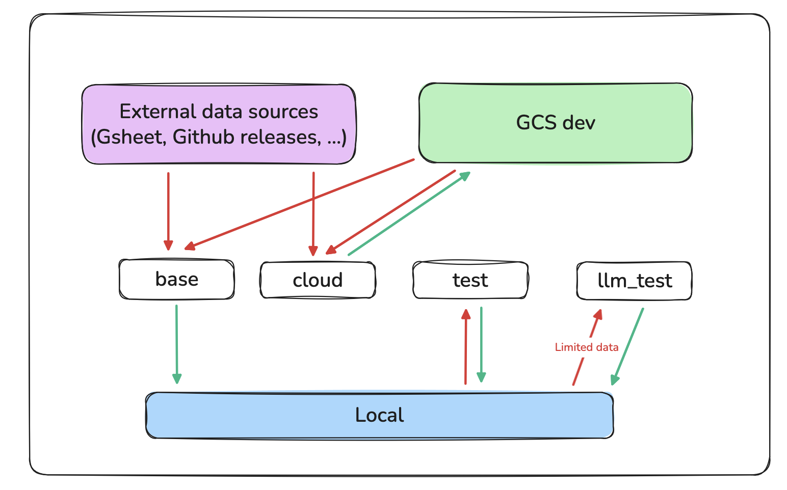
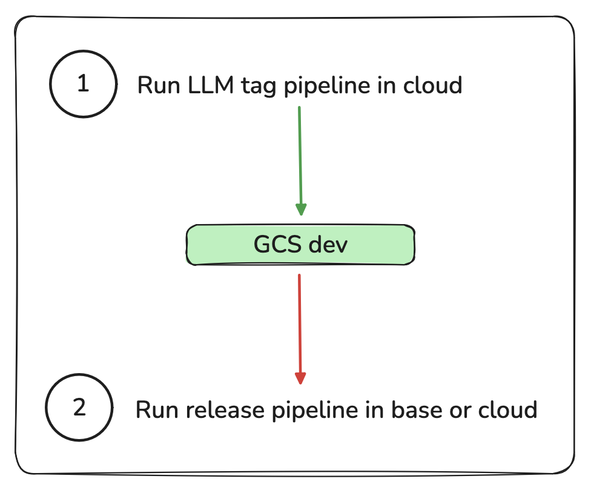

# EC Core Entities

This repository contains code to generate high quality disease and drug lists. 

The datasets are rooted on manually curated lists, with LLM added features.

## Installation 

### Install dependencies 

Prerequisites:
- Python 3.11
- uv

```bash
# Clone the repository
git clone https://github.com/everycure-org/matrix.git
cd pipelines/core_entities

# Install dependencies
make install
```

### Google sheet service account key

This service account is used to access the Google sheets containing the manually curated drug and disease lists:
* [Drug list Google sheet](https://docs.google.com/spreadsheets/d/1LjUOaq1ARiQCFj7eN9KIOaBgixBedoyjkIjbLP5lExI/edit?gid=1299365445#gid=1299365445)
* [Disease list Google sheet](https://docs.google.com/spreadsheets/d/1l29b-2MNfNf0EBtjLq7tFEZmZwxTZz1rfezx5RevuaA)

1. Create or download a service account key 
2. Save the key to the `conf/local/gsheet_service_account.json` file
3. Share the Google sheets above with the service account email

### OpenAI API key

This API key is used to access the OpenAI API for LLM tasks.

1. Create or download an OpenAI API key
2. Copy paste the .env.defaults file and rename it to `.env`.
3. Set the `OPENAI_API_KEY` variable to the API key you created.

### Github token (optional)

This token is used to access the disease list Github releases. You can access it without the token, but you might hit the rate limit.

1. Create a Github token with the permission to read releases.
2. In the .env file, set the `GH_TOKEN` variable to the token you created.

## Releases

### Artefacts 

You can find published releases in our public GCS bucket and on BigQuery
* Drug lists
  * [GCS](https://console.cloud.google.com/storage/browser/data.dev.everycure.org/data/01_RAW/drug_list/)
  * [BigQuery](https://console.cloud.google.com/bigquery?project=ec-orchard-prod&ws=!1m4!1m3!3m2!1sec-orchard-prod!2sdrug_list)
* Disease lists
  * [GCS](https://console.cloud.google.com/storage/browser/data.dev.everycure.org/data/01_RAW/disease_list/)
  * [BigQuery](https://console.cloud.google.com/bigquery?project=ec-orchard-prod&ws=!1m4!1m3!3m2!1sec-orchard-prod!2sdisease_list)

Non-published releases are stored in our dev GCS bucket: [Drug lists](https://console.cloud.google.com/storage/browser/mtrx-us-central1-hub-dev-storage/kedro/data/core-entities/drug_list/) and [Disease lists](https://console.cloud.google.com/storage/browser/mtrx-us-central1-hub-dev-storage/kedro/data/core-entities/disease_list/)

### Versioning

We use semantic versioning (semver) for all releases:

Format: `vMAJOR.MINOR.PATCH` (e.g., `v0.1.0`, `v1.2.3`)
* **MAJOR**: Incompatible schema changes (column removal, type changes)
* **MINOR**: Same spine, useful for systems compatibility
* **PATCH**: Bug fixes, new columns, data corrections

Example:  Orchard, Matrix and P2R can safely collaborate if they use versions 0.3.1, 0.3.16 and 0.3.19

 When to Bump Versions
* **MAJOR** (v0.2.0 → v1.0.0): Removed columns, changed data types, restructured
* **MINOR** (v0.1.1 → v0.2.0): Changes in id spine
* **PATCH** (v0.1.0 → v0.1.1): Fixed incorrect data, corrected values, changed translator_id (Name Resolver or Node Normalizer) or added a column

## Code structure 

This repository uses Kedro to manage the data pipelines.

### Kedro pipelines 

We make a difference between release pipelines and LLM pipelines. Release pipelines can be easily run locally and produce the output artefacts. LLM pipelines are usually run in a Github Action as they take a long time to complete. They produce LLM artefacts that will be ingested by the release pipelines.

* Release pipelines:
  * `disease_list`
  * `drug_list`
* LLM pipelines: 
  * `disease_umn`
  * `disease_labels`
  * `disease_prevalence`

### Kedro environments

- `base` for local releases (read production datasets, write local datasets)
- `cloud` for public releases (read production datasets, write dev GCS)
- `test` for local development and CI (read/write local datasets)
- `llm_test`  same as test but smaller datasets because of cost constraints (read/write local datasets)



### LLM pipelines release

- Run LLM pipelines in [this github action](https://github.com/everycure-org/matrix/actions/workflows/core_entities_run_pipeline.yaml)
- They will publish files in [the dev GCS bucket](https://console.cloud.google.com/storage/browser/mtrx-us-central1-hub-dev-storage/kedro/data/core-entities)
- They can then be used as data sources in the release pipelines
- Update the version in the `globals.yml` file to point to the new LLM artefacts.



### Release pipeline release

- Run first locally in the `base`  environment to make sure everything is fine
- Run release pipelines using [the `run_pipeline` github action](https://github.com/everycure-org/matrix/actions/workflows/core_entities_run_pipeline.yaml)
- Upon completion, a pull request will be created with the release notes and a comparison of the new release with the base release. 
    - Double check that you are happy with the changes, or investigate them further using notebooks in the `runbooks` folder.
    - Rename the PR as the PR name will be used to describe the release in the datasets repository.
- Merging the pull request will automatically trigger the release publication to the public GCS and BQ via [the `publish_release` github action](https://github.com/everycure-org/matrix/actions/workflows/core_entitities_publish_release.yaml)
