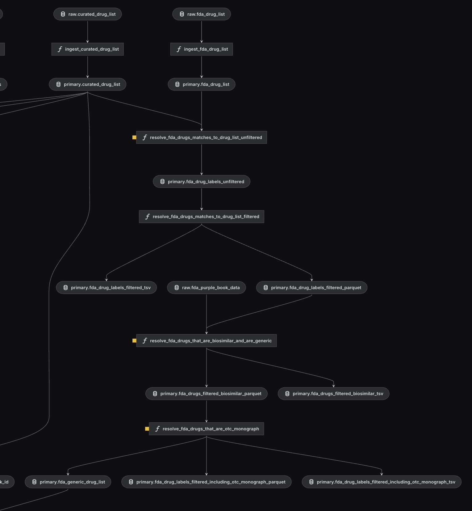
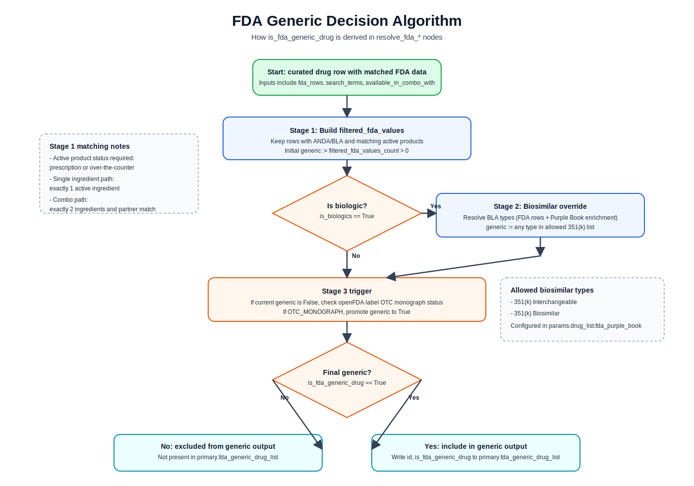

# FDA Generic Data Flow

This document describes how the drug list pipeline computes `is_fda_generic_drug` and which three FDA-related data sources are used.



## Three FDA Data Sources

| Source                  | Kedro input                                          | Configuration                                                                     | Where used                                      |
| ----------------------- | ---------------------------------------------------- | --------------------------------------------------------------------------------- | ----------------------------------------------- |
| 1. Drugs@FDA dataset    | `raw.fda_drug_list`                                  | `https://download.open.fda.gov/drug/drugsfda/drug-drugsfda-0001-of-0001.json.zip` | Base FDA match rows and initial generic signal  |
| 2. FDA Purple Book data | `raw.fda_purple_book_data`                           | `purple_book_url`                                                                 | Biosimilar BLA type enrichment for biologics    |
| 3. openFDA Label API    | Runtime API calls from `params:drug_list.fda_labels` | `https://api.fda.gov/drug/label.json`                                             | OTC monograph checks for non-generic candidates |

## Pipeline Steps

1. `ingest_fda_drug_list` normalizes raw Drugs@FDA JSON into `primary.fda_drug_list`.
2. `resolve_fda_drugs_matches_to_drug_list_unfiltered` matches curated drugs against FDA rows.
3. `resolve_fda_drugs_matches_to_drug_list_filtered` computes `filtered_fda_values` and sets the initial flag: `is_fda_generic_drug = filtered_fda_values_count > 0`.
4. `resolve_fda_drugs_that_are_biosimilar_and_are_generic` refines the generic flag for biologics using Purple Book BLA types.
5. `resolve_fda_drugs_that_are_otc_monograph` checks OTC monograph status through the openFDA label API and updates the flag.
6. The node outputs `primary.fda_generic_drug_list`, which is merged into the final release drug list.

## Decision Algorithm: What Is Considered FDA Generic

A drug is considered FDA generic when the final boolean flag `is_fda_generic_drug` is true after all three stages below.



### Stage 1: Base Generic Signal From Drugs@FDA Matches

For each curated drug, candidate FDA rows are matched first, then filtered.

1. Candidate FDA rows are matched by substring against configured fields:
   - `openfda.substance_name`
   - `products.active_ingredients.name`
2. A matched FDA row is kept only if:
   - `application_number` starts with `ANDA` or `BLA`
   - It has at least one matching product with active marketing status (`prescription` or `over-the-counter`)
3. Product-level match rules:
   - Single-ingredient path:
     - Product must have exactly one active ingredient
     - Ingredient must match the drug search terms
     - Combo-like ingredient strings are excluded
   - Combo path (when `available_in_combo_with` exists):
     - Product must have exactly two active ingredients
     - One ingredient must match the drug
     - The other must match one combo partner
4. `filtered_fda_values_count = len(filtered_fda_values)`
5. Initial flag:
   - `is_fda_generic_drug = (filtered_fda_values_count > 0)`

### Stage 2: Biologics Override Via Purple Book

Rows with biologic evidence (`application_number` starts with `BLA`) are re-evaluated.

1. Collect BLA types from FDA row content and enrich from Purple Book by BLA number when available.
2. Compare resulting BLA types to allowed generic biosimilar types from config:
   - `351(k) Interchangeable`
   - `351(k) Biosimilar`
3. For biologics only, replace the flag with this biosimilar decision.
4. For non-biologics, keep the Stage 1 value unchanged.

### Stage 3: OTC Monograph Promotion

Only rows still marked non-generic are checked against openFDA labels.

1. Query openFDA label API by drug name.
2. If status is `OTC_MONOGRAPH`, mark `is_otc_monograph = True`.
3. Final update:
   - `is_fda_generic_drug = is_fda_generic_drug OR is_otc_monograph`

### Final Inclusion in Output

`primary.fda_generic_drug_list` includes only rows where `is_fda_generic_drug == True`, with columns:

- `id`
- `is_fda_generic_drug`

In concise pseudocode:

```text
generic = has_filtered_fda_rows_after_anda_or_bla_and_product_rules
if is_biologic:
	 generic = has_allowed_biosimilar_bla_type
if otc_monograph_match:
	 generic = True
output_row_if(generic)
```

## Code References

- Pipeline wiring: [src/core_entities/pipelines/drug_list/pipeline.py](../../src/core_entities/pipelines/drug_list/pipeline.py)
- Ingest node: [src/core_entities/pipelines/drug_list/nodes.py#L404](../../src/core_entities/pipelines/drug_list/nodes.py#L404)
- Filtered generic derivation: [src/core_entities/pipelines/drug_list/nodes.py#L1105](../../src/core_entities/pipelines/drug_list/nodes.py#L1105)
- Biosimilar refinement: [src/core_entities/pipelines/drug_list/nodes.py#L1153](../../src/core_entities/pipelines/drug_list/nodes.py#L1153)
- OTC monograph refinement + final generic list output: [src/core_entities/pipelines/drug_list/nodes.py#L1319](../../src/core_entities/pipelines/drug_list/nodes.py#L1319)
- Source catalog entries: [conf/base/drug_list/catalog.yml](../../conf/base/drug_list/catalog.yml)
- Label API config: [conf/base/drug_list/parameters.yml#L83](../../conf/base/drug_list/parameters.yml#L83)
