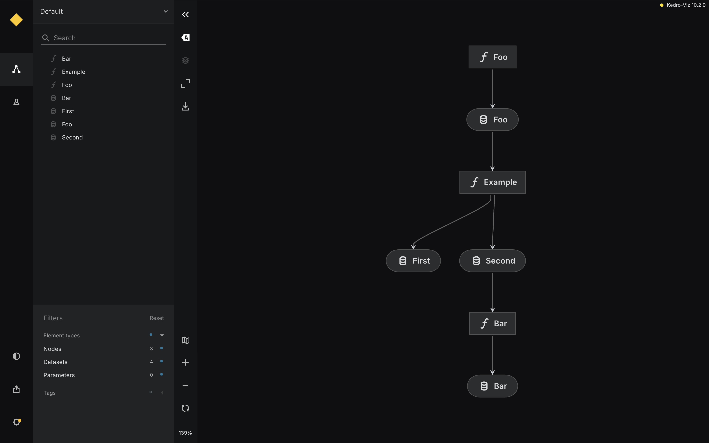

# Kedro pipeline Parallel execution

Matrix uses Kedro as it's main data pipelining framework, ensuring reproducable and re-usable data science workflows. However, to execute pipelines<sup>1</sup> in a distributed setting we're using Argo Workflows. This document aims to describe the process of executing a Kedro pipeline on Argo workflows.

<sup>1</sup> To complicate the matters even further, these pipelines contain nodes with varying hardware requirements such as GPUs.

## Kedro vs Argo Workflows

Before diving into the process, it's important to highlight the differences between Kedro and Argo. See the table below.

> 💡 Kedro is for development, while Argo is used for pipeline execution. Moreover, Kedro orchestrates nodes using their dataset dependencies, whereas Argo ochestrates tasks using task dependencies.

| Feature / Aspect            | **Kedro**                                                | **Argo Workflows**                                          |
|----------------------------|----------------------------------------------------------|-------------------------------------------------------------|
| **Purpose**                | Data and ML pipeline development                         | Container-native workflow orchestration on Kubernetes       |
| **Execution Environment**  | Local, on-prem, CI/CD, or deployed to Airflow/KubeFlow   | Kubernetes (must run on a Kubernetes cluster)               |
| **Pipeline Definition**    | Python-based, using `nodes` and `pipelines` abstraction  | YAML-based DAGs of container steps with dependencies        |
| **Best For**               | ML/data engineering teams building reproducible pipelines| DevOps teams running scalable, Kubernetes-native workflows  |
 
## Mapping Kedro nodes to Argo tasks

The first decision to be made is how Kedro nodes are mapped to Argo tasks. There are two immediately obvious, albeit extreme, directions:

1. Single Argo task for _entire_ pipeline
   - Pros:
      - Simple setup, Argo task invokes `kedro run` for entire pipeline
   - Cons:
      - Limited options for leveraging parallelization
      - Entire pipeline has to run with single hardware configuration
         - May be very expensive for pipelines requiring GPUs in some steps
1. Argo task for _each_ node in the pipeline
   - Pros:
      - Maximize parallel processing capabilities
      - Allow for different hardware configuration per node
   - Cons:
      - Scheduling overhead for very small Kedro nodes
      - Complex DAG in Argo Workflows

For our use-case, a pipeline with hundreds of nodes, we want to enable fusing sets of related<sup>2</sup> nodes for execution on _single_ Argo task. This avoids scheduling overhead while still supporting heterogeneous hardware configurations within the pipeline.

<sup>2</sup> Related here is used in the broad sense of the word, i.e., they may have similar hardware needs, are highly coupled, or all rely on an external service.

## Fusing related nodes

### Using a composite function in the Kedro node

A possible approach to wrapping related nodes is to define a composite function, e,g., consider the pipeline below.

```python
def create_pipeline():
    return pipeline(
        [
            node(
                func=dummy,
                inputs=[],
                outputs="foo",
                name="first",
            ),
            node(
                func=dummy,
                inputs=["foo"],
                outputs="bar",
                name="second",
            ),
        ],
    ),
```

One could wrap the nodes as follows:

```python
def wrap():
    """Composite function to wrap 
    nodes for execution."""
    foo = dummy()
    bar = dummy(foo)

    return foo, bar

def create_pipeline():
    return pipeline(
        [
            node(
                func=wrap,
                inputs=[],
                outputs=["foo", "bar"],
                name="composite",
            ),
        ],
    ),
```

Unfortunately, this breaks the "kedro way" and introduces additional code complexity, as the composite node needs to know all inputs/outputs of each of the fused nodes. Moreover, for large sets of fused nodes, this results in decreased performance as Kedro can no longer run the functions of the composite node in parallel.

### Defining a Fusing Pipeline

An alternative solution would be to try to colocate the nodes into another pipeline. This pipeline would essentially define the fusing boundary, giving full control to the user without breaking the Kedro pattern.

```python
def create_pipeline(**kwargs) -> Pipeline:
    return pipeline(
        [
            node(
                func=dummy,
                inputs=[],
                outputs="fuse.foo",
                name="foo",
            ),
            # This pipeline object defines the fusing boundary
            pipeline(
                [
                    node(
                        func=dummy,
                        inputs=["fuse.foo"],
                        outputs="fuse.first",
                        name="first",
                    ),
                    node(
                        func=dummy,
                        inputs=["fuse.first"],
                        outputs="fuse.second",
                        name="second",
                    ),
                ],
                name="example",
            ),
            node(
                func=dummy,
                inputs=["fuse.second"],
                outputs="fuse.bar",
                name="bar",
            ),
        ]
    )
```

Unfortunately, Kedro's scheduling execution mechanism flatmaps nested pipeline objects, i.e., the entrypoint to the runner
is a flat list of nodes to execute. To solve for this, we have to create or own `Pipeline implementation`. The key idea
here is that the `nodes` propery of this pipeline does not return the list of nodes, but rather a custom `FusedNode` that
wraps the fused nodes.


```python
from typing import Iterable, List

from kedro.io import DataCatalog
from kedro.pipeline import Pipeline
from kedro.pipeline.node import Node
from kedro.runner.sequential_runner import SequentialRunner
from pluggy import PluginManager


class FusedNode(Node):
    """FusedNode is an extension of Kedro's internal node. The FusedNode
    wraps a set of nodes, and correctly sets it's `inputs` and `outputs`
    allowing it to act as a single unit for execution.
    """
    def __init__(self, nodes: List[Node], name: str):
        self._nodes = nodes
        self._name = name
        self._namespace = None
        self._inputs = []
        self._outputs = []
        self._confirms = []
        self._func = lambda: None
        self._tags = []

        for node in nodes:
            self._inputs.extend(node.inputs)
            self._outputs.extend(node.outputs)
            self._tags.extend(node._tags)

        # NOTE: Exclude ouputs made as part of the intermediate nodes
        for node in self._outputs:
            if node in self._inputs:
                self._inputs.remove(node)

        self._tags = list(set(self._tags))


class FusedPipeline(Pipeline):
    """Fused pipeline allows for wrapping nodes for execution by the underlying
    pipeline execution framework.

    This is needed, as Kedro immediately translates a pipeline to a list of nodes
    to execute, where any pipeline structure is flatmapped. The FusedPipeline produces
    a _single_ FusedNode that contains the wrapped nodes."""

    def __init__(
        self,
        nodes: Iterable[Node | Pipeline],
        name: str,
        *,
        tags: str | Iterable[str] | None = None,
    ):
        self._name = name
        super().__init__(nodes, tags=tags)

    @property
    def nodes(self) -> list[Node]:
        return [FusedNode(self._nodes, name=self._name)]
```

From Kedro's perspective, there is now a single `FusedNode` that contains the nodes within the fusing boundary, and the respective inputs and outputs are set correctly.

> 💡 __Bonus__: this shows a single `kedro viz` node for each `FusedNode`, thereby simplifying the graphical representation a shown by the image below.
> 

#### Generating the Argo Workflow spec

Since the entire Kedro pipeline is now represented by a set of nodes, with some optional `FusedNode` objects, the process of converting the Kedro pipeline to an Argo Workflow DAG became very straight-forward Concretely, the fusing of nodes can be ignored during the DAG generation, as it is inherently embedded in the resulting `Pipeline` object.

```python
def get_argo_dag(pipeline: Pipeline) -> List[Dict[str, Any]]:
    """Function to convert the Kedro pipeline into Argo Tasks. The function
    iterates the nodes of the pipeline and generates Argo tasks with dependencies.
    These dependencies are inferred based on the input and output datasets for
    each node.

    NOTE: This function is now agnostic to the fact that nodes might be fused. The nodes
    returned as part of the pipeline may optionally contain FusedNodes, which have correct
    inputs and outputs for the perspective of the Argo Task.
    """
    tasks = {}

    # The `grouped_nodes` property returns the nodes list, in a toplogical order,
    # allowing us to easily translate the Kedro DAG to an Argo WF.
    for group in pipeline.grouped_nodes:
        for target_node in group:
            task = ArgoTask(target_node)
            task.add_parents(
                [
                    parent.node
                    for parent in tasks.values()
                    if set(clean_dependencies(target_node.inputs)) & set(clean_dependencies(parent.node.outputs))
                ]
            )

            tasks[target_node.name] = task

    return tasks
```

#### Implementing a `FusedRunner`

This is all great and well, but we now need to make the runner aware of this `FusedNode` in order to have it executed correctly, i.e., we want the runner to unpack the `FusedNode` and executed all of the nodes fused within.

To this end, we've extended the behaviour of the base `SequentialRunner`. The idea here is that a regular `Pipeline` object is created for the nodes in the `FusedNode`, allowing the fused nodes to be scheduled as usual.

```python
class FusedRunner(SequentialRunner):
    """Fused runner is an extension of the SequentialRunner that
    essentially unpacks the FusedNode back to the contained nodes for
    execution."""

    def _run(
        self,
        pipeline: Pipeline,
        catalog: DataCatalog,
        hook_manager: PluginManager,
        session_id: str | None = None,
    ) -> None:
        nodes = pipeline.nodes
        super()._run(
            Pipeline([Pipeline(node._nodes) if isinstance(node, FusedNode) else node for node in nodes]),
            catalog,
            hook_manager,
            session_id,
        )
```

The pipeline can now be ran as follows:

```bash
kedro run --runner fuse.FusedRunner
```

Whereas the Argo Workflows spec can be extracted using the command below:


```bash
kedro compile -p fuse
```